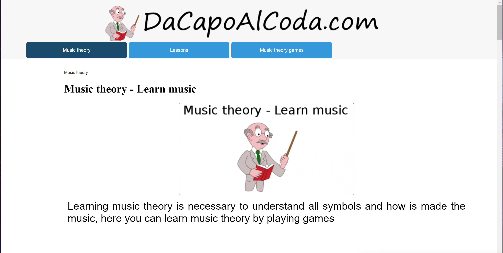

# Teaching Music Theory to Adult Men through the Internet
## Alyssa Simmons - Digital Humanities 110 - Spring 2022
### Assignment 01: Heuristic Evaluation

#### The Project
This project aims to use Nielson's 10 Heuristics to analyze a website's usability from the eyes of an adult male. Our purpose is to make music learning online as easy and fun as possible via good user interface design.

#### [Jakob Nielson's Usability Heuristics](https://www.nngroup.com/articles/ten-usability-heuristics/#poster)

| Number | Heuristic | Description |
|---|---|---|
| 1 | Visibility of System Status | The site should always inform users about what is going on, through appropriate feedback within a reasonable amount of time |
| 2 | Match Between System and the Real World | Concepts and language should be familiar and logical to the user |
| 3 | User Control and Freedom | Users should be able to escape an unwanted action without having to go through an extended process |
| 4 | Consistency and Standards | Follow conventions and make sure design is consistent throughout the site |
| 5 | Error Prevention | Minimize error-prone conditions and provide users with error safety nets |
| 6 | Recognition Rather Than Recall | Minimize user's memory load by giving them suggestions and help in context |
| 7 | Flexibility and Efficiency of Use | Make the site accessible to all users by providing multiple ways to perform a task |
| 8 | Aesthetic and Minimalist Design | Provide only relevant content and features |
| 9 | Help Users Recognize, Diagnose, and Recover From Errors | Tell users what the problem is and provide suggestions to fix it |
| 10 | Help and Documentation | Supply users with extra help to complete their tasks |

#### [DaCapoAlCoda](https://www.dacapoalcoda.com/)
*DaCapoAlCoda is a free site which aims to make learning music theory fun. 
It uses simple games to teach pitch, tempo, and sight reading.
It is mainly separated into three pages: music theory, lessons, and music theory games.* 

<!-- add image of website -->

#### Evaluation
*Summary: Overall DaCapoAlCoda has a long way to go in terms of usability. There is a lot of information on the site as music theory is a broad topic that people spend years studying so the main usability issues have to do with organization of the content. Fixing minor issues like adding documentation or fixing grammatical errors can allow DaCapoAlCoda to be an incredible resource for learning music theory in a fun and creative environment.*

**1. Visibility of system status** 
  * **Good:** Every game has a progress bar showing how close to the end of the game the user is. Each also has a progress bar showing how much time is left to guess. Further when the game is loading it shows the user how many sounds have loaded out of the total sounds needed to start the game (ie. Loading sounds: 4/12). 
  * **Bad:** It is very hard to navigate through the site as a whole. The user doesn't know where they are in the grand scheme of the website.
  * **Improvement:** Reorganize the site such that the pages link together better so the user can see where they are at all times.

**2. Match Between System and the Real World** 
  * **Bad:** The author of the website is French, but they designed the site only in English so they make many grammar mistakes which make the site incomprehensible at times. Further the site uses advanced music terminology without defining the words.
  * **Improvement:** Fix the grammar mistakes. Possibly add other language options to the site so it is usable for a larger userbase. Create a glossary defining music terms that is accessible from anywhere in the site. Alternatively allow users to hover over complex terms to see the definition.

**3. User control and freedom** 
  * **Good:** Most pages have arrows linking to the previous and next page. 
  * **Bad:** Users can only exit the games if they refresh the page. Otherwise the best they can do is pause the game. 
  * **Improvement:** Add a quit button in the games so users can easily stop playing/reset the game.

**4. Consistency and standards** 
  * **Good:** The games are consistently formated so they are at least fairly easy to go between.
  * **Bad:** There is almost no consistency from page to page especially the lessons, which distracts the user from learning.
  * **Improvement:** Create a single layout for all the lessons, which allow the user to focus more on understanding the content than trying to figure out the website.

**5. Error prevention** 
  * **Good:** When trying to change the game settings midgame (which causes the game to start over) a popup appears making sure the user can choose if they want this to happen. 
  * **Bad:** If the user enters an invalid email when leaving a comment, it doesn't trigger a popup asking them to insert a valid email.
  * **Improvement:** Also create a popup for when an invalid email is used so the user can be updated when their comment goes through.

**6. Recognition rather than recall** 
  * **Good:** All the games give possible clickable answers.
  * **Bad:** The user has to remember how to get to certain lessons in the website, because there is no easy way to see all the pages in the website.
  * **Improvement:** Create a better navigation menu linking the whole website together, so users can easily find what they are looking for.

**7. Flexibility and efficiency of use**  
  * **Good:** It shows there are keyboard shortcuts corresponding to the different notes so the user can play the game quicker.
  * **Bad:** The shortcuts don't actually work.
  * **Improvement:** Fix the shortcuts or remove the image showing the shortcuts exist to avoid confusing the users.

**8. Aesthetic and minimalist design**  
  * **Bad:** The site is unneccessarily convoluted. There are links everywhere and some of the pages are repetative, which distracts from learning the topics.
  * **Improvement:** Condense the lessons as much as possible to reduce the number of total pages and simplify the connections between pages so the number of links can be reduced.

**9. Help users recognize, diagnose, and recover from errors** 
  * **Good:** Has an error 404 Page Not Found which clearly states what the error is and directs the user to the site map so they can find whatever page they are looking for. When leaving a comment, if the user puts in the wrong code, it takes them to a separate page saying "Error, wrong code" which clearly tells the user how to fix their problem.
  * **Improvement:** Create a popup for when a user doesn't use the correct code instead of taking them to a new page.

**10. Help and documentation** 
  * **Good:** Every game has documentation explaining the game and what the settings mean, as well as how to play.
  *  **Bad:** There is no help/documentation. The closest is the site plan which can only be found if the user presses the next page arrow until they get to the map.
  * **Improvement:** Add a link to a cleaned up site map to the footer. 

#### Severity Rating 
1. Top Priority: Visibility of system status; Consistency and standards; Aesthetic and minimalist design
2. Important to Fix: Match Between System and the Real World; Error prevention; Recognition rather than recall; Flexibility and efficiency of use
3. Small Inconvenience: User control and freedom; Help users recognize, diagnose, and recover from errors; Help and documentation

#### [National Guitar Academy](https://nationalguitaracademy.com/)
*National Guitar Academy is a free site which aims to make learning guitar fun and accessible to all. 
It uses simple lessons with videos and sound clips to teach guitar theory and chord reading.
It is mainly separated into five pages: home, about, start here, easy chords and contact.*

<!-- add image of website -->

#### Evaluation 
*Summary: Overall National Guitar Academy is a fairly user friendly website, but the page organization is lacking. In order to make the site truly user friendly, it's important that users have a more efficient way to navigate through the site. Otherwise many of the issues were fairly surface level and easily fixed.*

**1. Visibility of system status** 
  * **Good:** Audio clips show how far along in the recording the user is. When videos are loading a spinning circle appears so the user knows the action is loading.
  * **Bad:** Lessons typically span at least two pages and no indication of how far in the lesson the user has progressed is given. In the guitar quiz the progress bar does not accurately show progress on the quiz. Despite the quiz being 10 questions long, the progress bar is over 50% full after the first question is answered. There is also no way of determining where the user is on the site at any time.
  * **Improvement:** Either condense lessons to be more manageable or separate them into sections so progress can be shown as the user scrolls through the lesson so they don't become bored and give up because the lesson seems neverending. Update the guitar quiz progress bar to be proportional to the progress through the quiz. Add an arrow sequence to the top of the page so the user knows where exactly they are in the site.

**2. Match Between System and the Real World** 
  * **Good:** The icons used match what would generally be expected (YouTube is represented by a triangle in a rounded rectangle, etc).
  * **Bad:** Sometimes fails to define certain music theory terms before using them like sharp/flat so a novice could be easily confused.
  * **Improvement:** Define all the music terms in a little popup that can be viewed when hovering over the word so as not to clutter the page but also provide information if the user desires it.

**3. User control and freedom** 
  * **Bad:** Users can only exit the quiz if they refresh the page. 
  * **Improvement:** Add an exit button to the quiz. 

**4. Consistency and standards** 
  * **Good:** Generally the lessons follow the same format: a bullet point outline of what the lesson contains followed by the content.
  * **Bad:** The style of the chord diagram changes based on the page, which can be confusing to a new learner.
  * **Improvement:** Standardize the chord diagram. Organize the lessons such that the individual sections of the lesson can link with the bullet point outline so the user can choose what they want to learn based on past knowledge. 

**5. Error prevention** 
  * **Good:** If the user inputs the wrong link and it is close enough to another page name it will automatically take you to that existing page. For example [https://nationalguitaracademy.com/guitar/](url) will autocorrect to [https://nationalguitaracademy.com/guitar-arpeggios/](url).
  * **Bad:** When entering an email incorrectly there is no way to know because the site doesn’t send a confirmation email or ask the user if all the information is correct.
  * **Improvement:** Send a confirmation email when joining the mailing list asking the user to confirm and change the post-signup message informing the user to check their inbox.

**6. Recognition rather than recall** 
  * **Good:** All questions in the quiz are multiple choice, so the user don't have to remember them on their own.
  * **Bad:** The user has to remember how to get to certain lessons in the website, because there is no easy way to see all the pages in the website.
  * **Improvement:** Create an organized site map linking all the pages together and add it to the footer so it can be accessed from anywhere on the site.

**7. Flexibility and efficiency of use**  
  * **Good:** The quiz has shortcuts such that the user can type in the corresponding letter/number instead of dragging and clicking on the answers.
  * **Bad:** There is no shortcut to get to the top of the page, which would be useful on the long lessons.
  * **Improvement:** Add a shortcut to get to the top of the page.

**8. Aesthetic and minimalist design**  
  * **Good:** The site is fairly minimal. The start here page is well organized and simple.
  * **Bad:** Certain blocks are not centered properly which can make them difficult to read and use. 
  * **Improvement:** Properly center the blocks. 

**9. Help users recognize, diagnose, and recover from errors** 
  * **Good:** If the user is sending a voice message and they did not enable microphone access, an error message occurs explaining this which includes a button which enables the microphone when pressed. When a user tries to input an email that doesn't follow the blank[at]blank.com, blank[at]blank.net, etc format an error message occurs asking the user to check the formatting.
  * **Bad:** When a user's link is to a nonexistent page there is no error warning explaining what happened. Instead there is only a blank page.
  * **Improvement:** Create a 404 page not found error message informing the user to check the site path because the page they searched for does not exist.

**10. Help and documentation** 
  * **Bad:** There is no help or documentation. The only help offered would be via contacting the site runners through their message board.
  * **Improvement:** Add a FAQ page which can be accessed in the footer from anywhere on the site. Could add a glossary of guitar music terms to the footer as well.

#### Severity Rating 
1. Top Priority: Visibility of system status; Recognition rather than recall
2. Important to Fix: Match Between System and the Real World; Error prevention; Help users recognize, diagnose, and recover from errors
3. Small Inconvenience: User control and freedom; Consistency and standards; Flexibility and efficiency of use; Aesthetic and minimalist design; Help and documentation
